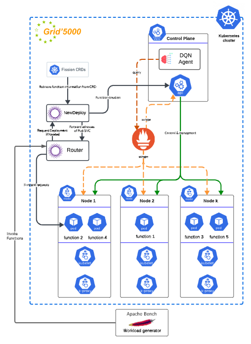

# 🚀 **FoRLess: A Deep Reinforcement Learning-based Approach for FaaS Placement in Fog**  

---

## 📄 **Abstract**  
Function-as-a-Service (FaaS) is a programming model in which developers write event-triggered functions, and the FaaS platform automatically manages resource allocation and function execution. FaaS is well-suited for building fog applications deployed at any location on the cloud-edge continuum, delivering both flexibility and resource efficiency.  

However, current FaaS platforms often fail to meet latency and energy consumption requirements. This paper addresses this limitation by exploring the use of **Deep Reinforcement Learning (DQN)** to optimize FaaS function placement.  

We propose **FoRLess**, a DQN-based scheduler designed to learn the optimal function placement, improving the platform’s ability to satisfy latency and energy consumption requirements. This scheduler is integrated into an open-source FaaS platform. Experiments conducted in the Grid'5000 testbed demonstrate that our approach achieves reductions in latency and energy consumption of up to **7.15%** and **12%**, respectively, compared to the baseline scheduler.  

---

## 🔑 **Keywords**  
- 🖥️ **Function as a Service (FaaS)**  
- 📊 **Scheduling**  
- 🤖 **Deep Reinforcement Learning**  
- ⚙️ **Resource Management**  

---

## 📚 **Table of Contents**  
1. [📢 Introduction](#-introduction)  
2. [💡 Proposed Approach](#-proposed-approach)  
3. [🔬 Experimental Evaluation](#-experimental-evaluation)  
4. [📈 Results and Discussion](#-results-and-discussion)  
5. [✅ Conclusion](#-conclusion)  
6. [📚 References](#-references)  

---

## 📢 **1. Introduction**  
Fog computing and FaaS have gained popularity due to their scalability and flexibility. However, deploying FaaS in fog environments presents challenges, including **latency** and **energy efficiency.** This research proposes a novel DQN-based scheduling framework that addresses these issues.

---

## 💡 **2. Proposed Approach**  
### 📐 **System Architecture**  

<p align="center">
  
</p>

### 🧠 **Deep Reinforcement Learning Framework**  
The DQN-based scheduler dynamically assigns functions to fog nodes, minimizing **latency** and **energy consumption**.

---

## 🔬 **3. Experimental Evaluation**  
- **Testbed:** Grid'5000  
- **Metrics:** ⏱️ Latency, 🔋 Energy Consumption  
- **Baseline:** Compared with conventional schedulers.

---

## 📈 **4. Results and Discussion**  
### 📊 **Performance Overview**  


| **Metric**               | **Improvement** |
|--------------------------|------------------|
| 🕒 **Latency (ms)**       | **7.15%**       |
| 🔋 **Energy (kWh)**       | **12%**         |
| ⚠️ **Overhead (kWh)**     | **-1.88%**       |
| ⚡ **Total Energy Consumption** | **9.95%**    |


---

### 📊 **Visual Results**  


---

## ✅ **5. Conclusion**  
Our proposed method improves both latency and energy efficiency. Future work includes scaling the evaluation to more complex fog environments.

---

## 📌 **How to Cite**  
```bibtex
@inproceedings{latreche2024forless,
  title={FoRLess: A Deep Reinforcement Learning-based approach for FaaS Placement in Fog},
  author={Latreche, Cherif and Parlavantzas, Nikos and Duran-Limon, Hector A},
  booktitle={UCC 2024-17th IEEE/ACM International Conference on Utility and Cloud Computing},
  pages={1--9},
  year={2024}
}
